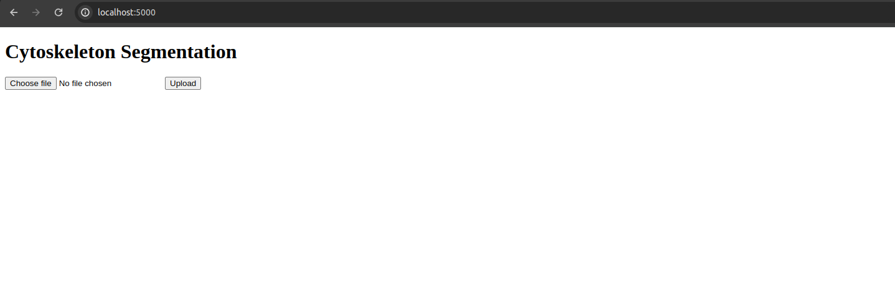

# CARE: Cytoskeleton Analysis and Reporting Engine

[](https://opensource.org/licenses/MIT)

## Description

This is a flask app that a user can run on the browser for analysis of cell cytoskeleton. It is assumed that the user has collected images using confocal microscopy with relevant immunostaining (like phalloidin). Currently, the app is expected to return images with an overlay of different cytoskeletal components. Basic familiarity with Linux terminals is necessary for using this tool.

## Table of Contents

- [Installation](#installation)
- [Usage](#usage)
- [Contributing](#contributing)
- [License](#license)
- [Contact](#contact)

## Installation

Please make sure you have all the required Python packages to run this app. A computer with GPU is preferred but this might also run on CPUs (not tested). <br>
<br>
The missing packages can be installed using `pip install -r requirements.txt`

## Usage

The model and config file can be downloaded using `download.sh`. <br>
Make sure that you change the permissions accordingly `chmod +x download.sh` and run the following in your terminal from the project folder `./downloads.sh`
<br>
<br>
Once the model and config file are downloaded the app can be started by running ```python3 app.py```<br>
<br>
The user can then open the browser and type https://localhost:5000<br>
<br>
This should load the html page that looks something like <br>
Click on `Choose file` button and upload your `tif` file form your computer. Then click on `upload` button. Depending on the model, config, system configuration, and user file size this might take a few minutes to run the analysis.<br>
<br>
If the analysis is finished successfuly it will load the image on your browser something like this 
<br>
**Note:** you might have to change the values of thresholds in the config.json to suit your data

## Contributing

This project is still being developed and we would love to have contributions from the users both in the form of suggestions under (`Issues` and `Discussions` sections) and `Pull requests`.

## License

This project is licensed under the [MIT License](LICENSE).

## Contact

If you have questions or want to contribute to the project, contact:

- Vineeth Aljapur (mailto:vineethajapur@cmail.carleton.ca)
